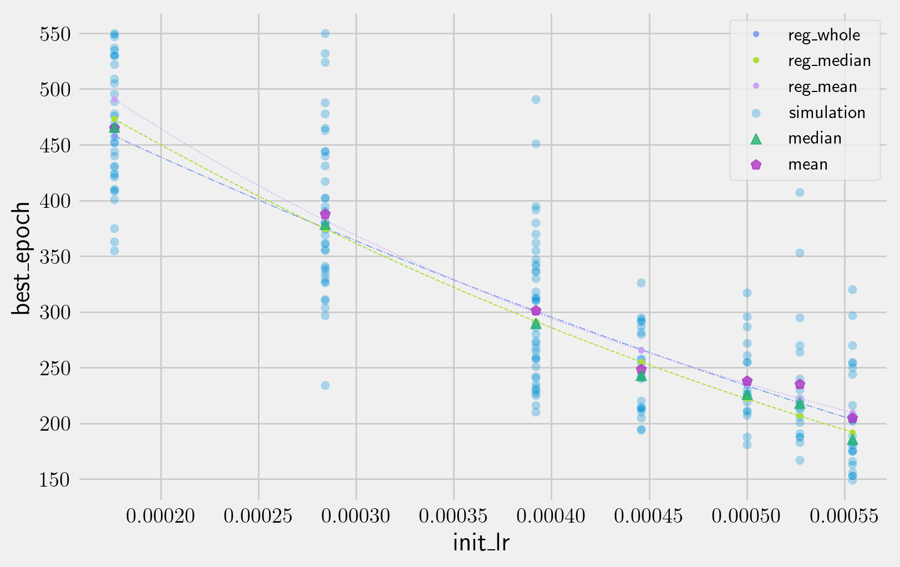

**KOR** · [ENG](./README_EN.md)

---

# :wave: Hi there, I'm Doeun Oh.

## Tech Stack

- NumPy, Pandas, Keras, Torch, Scikit-learn, Matplotlib, MySql
<!--
    

   
-->

# 주요 경험

## [DACON 재정정보 AI 검색 알고리즘 경진대회 참여](https://github.com/theNocturni/WASSUP-DACON-FinAI)

### 개요

- 24.07.24 - 24.08.21, 24.09.27 - 24.12.31
- **Libraries** : huggingface, langchain, peft, faiss, trl, pymupdf, gmft
- [주어진 재정정보 pdf 문서](https://dacon.io/competitions/official/236295/overview/description)를 바탕으로 질문에 답변하는 gemma2 기반 LLM 모델을 RAG, LoRA를 활용하여 학습.
- **대회 성적**
  - metric : 문장에서 문자 단위의 F1 score
  - Public 0.666, Private 0.673, 최종순위 38/359 (상위 10.58%)
- 경진대회 마감 이후, 성능 개선을 위한 실험 설계 및 실험 진행 중
  - 현재 성적 | Public 0.715 : 현재 25/359, Private 0.693 : 대회 종료 시점의 23등에 준하는 성적

### 기여

- pymupdf와 gmft를 이용한 표 전처리, 코드 리팩토링 등에 기여
  - 표 전처리를 통해 Public 기준, 0.657에서 0.666으로 증가하고, 이후 0.690으로 증가

## 알라딘 주간 베스트 셀러/중고 매장 도서 Dataset 구축 및 관련 프로젝트 진행

### 0. [알라딘 주간 베스트 셀러/중고 매장 도서 Dataset 구축](https://github.com/kdt-3-second-Project/aladin_usedbook) 및 [배포](https://github.com/kdt-3-second-Project/aladin_book_dataset/)

#### 개요

- 24.07.10 - 24.07.22, 25.03.03 - 25.03.06
- **Libraries** : NumPy, Pandas, Beautifulsoup, re
- 알라딘 00년 1월 1주차 ~ 24년 7월 2주차의 베스트셀러 목록을 크롤링하여 141.5만 행의 Dataset 구축
  - 15.8만 여종의 도서에 대하여, 해당 주 차에서의 순위 및 도서 관련 정보를 포함
- 주간 베스트 셀러 DB를 바탕으로, 78만 행의 알라딘 중고 매장의 중고 도서 Dataset 구축
  - 10.3만 여종의 역대 베스트셀러 도서에 대한 중고 도서 매물 데이터

#### 기여

- 조장으로서 프로젝트 기획 및 진행
- 크롤링 코드 개발, dataset 및 model의 prototype 개발, 실험 설계, 진행 및 평가 등에 기여
- 데이터셋 정리 및 배포

### 1. [알라딘 중고매장 도서 가격 예측 모델 개발](https://github.com/kdt-3-second-Project/aladin_usedbook)

#### 개요

- 24.07.10 - 24.07.22, 24.10.19~24.10.23
- **Libraries** : NumPy, Pandas, Matplotlib, re, Scikit-learn, xgboost, Mecab, cupy
- 위의 알라딘 중고매장 도서 Dataset으로 알라딘 중고도서 가격 예측 모델 개발
  - 10.3만 여종의 역대 베스트셀러 도서에 대한 78만 행의 중고 도서 매물 데이터
- XGBoost Regressor를 이용
  - cross validation과 grid search를 이용하여 486개의 조합 중 우수 hyperparameter 14개를 추림
    - XGBoost Python API 및 cupy를 이용하는 grid search & cross validation 함수를 만들어 연산 속도 개선
  - 우수 hyperparameter로 학습한 모델들을 두 가지 방법으로 평가
    - test 1 : 초기에 test set으로 나눈 데이터로 평가
    - test 2 : test set 중 train set에 포함된 적 없는 종류의 도서에 한해서 평가
- Best model
  - 독립변수 : 중고품질, 취급지점, 도서명, 도서명에 포함된 부가적 문구(양장본, 한정판 등), 저자, 기타 저자, 출판사, 출간일, 정가, 대분류
  - hyperparameter
    - *num_boost_round* : 2500
    - *learning_rate* : 0.3
    - *max_depth* : 6
    - *min_child_weight* : 4
    - *colsample_bytree* : 1
    - *subsample* : 1

  

  <i><b>도표.1</b> best model의 feature importance</i>

  ||RMSE|R2 score|N|
  |:--:|--:|--:|--:|
  |**test 1**|610.7|0.973|156,843|
  |**test 2**|1,440|0.914|5,968|
  <!--|harmonic mean|857.8|0.943||-->

  <i><b>도표.2</b> test별 데이터셋의 크기 및 XGBoost Regressor에서의 최고 성적</i>

#### 기여

- 조장으로서 프로젝트 기획 및 진행
- 크롤링 코드 개발, dataset 및 model의 prototype 개발, 실험 설계, 진행 및 평가 등에 기여

#### 배운 점

- 적절한 모듈화가 개발의 효율성 및 코드의 가독성에 주는 영향력을 체감
- 소수의 샘플로 빠른 개발을 진행하여, 현재의 방법론이 가능한지 혹은 적절한지 평가하는 것은 전략적으로 유효
  - 프로젝트의 방향성을 잡는데 도움이 되고, 좋은 baseline의 기준이 될 수 있음
  - 도메인 지식 등을 이용해 휴리스틱한 판단을 하는 것은 빠르게 prototype를 개발하는데 유효한 도움이 될 수 있음
- 모델이 접한적 없는 종류의 데이터로 제한된 test를 재진행하여 모델의 학습 정도에 대해서 적극적으로 평가
  - train set에 포함 된 적 없는 종류의 도서에 대해서만 추가로 평가. 도서 별 가격을 모델이 외운 것이 아니라 자연어 처리 결과를 모델이 반영하고 있음을 확인
- 데이터 셋의 column 중 불명확한 것은 사용하지 않아도, 모델의 복잡도를 높혀서 성능이 좋고 더 강건한 모델을 개발할 수도 있음을 확인
  - best model에 쓰인 hyperparamter를 포함하여, 동일한 hyperparameter로 SalesPoint를 제외하고 학습시켰을 때 성능이 더 좋고 더 강건한 경우가 있는 것을 확인.
- 간단한 모델로 리버스 엔지니어링을 진행하여, 알라딘 중고매장 도서 가격 산정 시스템이 많이 복잡하지는 않을 것이라 유추할 수 있었음
- 연산량의 관점에서 grid search는 hyperparameter 탐색에 매우 비효율적
  - 모델에 맞게 hyperparameter의 탐색 순서를 설정하거나, Bayesian search 등을 활용하면 연산에 드는 자원 등을 효율적으로 사용할 수 있었을 것이라 기대
- 몇 십만 개 단위의 데이터를 XGBoost로 다룰 땐, Sci-kit API 보다 Python API를 이용하고, 특히 cupy를 통해 gpu를 사용하면 연산속도를 빠르게 할 수 있음

### 2. [Encoder only transformer 기반 도서 정가 예측 모델 개발 및 initial learning rate와 best epoch의 분포 사이 관계 조사](https://github.com/doeun-235/aladin_book_price)

#### 개요

- 24.10.23 - 24.11.19, 25.01.04 - 25.02.26
- **Libraries** : PyTorch, NumPy, Pandas, Matplotlib, re, Scikit-learn, xgboost, [Mecab](https://pypi.org/project/python-mecab-ko/)
- 위에서 구축한 알라딘 베스트셀러 데이터셋을 사용하여, 저자, 책이름, 출간날짜 등의 정보로 정가를 예측
- encoder only transformer 기반 모델을 개발한 뒤, 성적을 평가하고 initial learning rate(이하 *init_lr*)와 *best_epoch*의 분포 사이 관계 조사
- 성적 : RMSE, R2 Score에서 Random Forest나 XGBoost 등 보다 좋은 성적을 기록

  |        |Encoder Based Model|        RFR |        XGB  |        MLP  |
  |--------|------------------:|-----------:|------------:|------------:|
  |RMSE    | 8337.54     | 9079.71    | 9544.35     | 10034.56    |
  |MAPE    |    0.359422 |    0.30136 |    0.36642  |    0.39802  |
  |R2 SCORE|    0.4744   |    0.37666 |    0.31123  |    0.23795  |

  *<b>도표.3</b> 각 실험 별 best model과 성능*

  

  *<b>도표.4</b> test set의 정가, encoder based model의 오차 및 상대오차 histogram. 셋 모두 가독성을 위해 plot에서 X축의 범위를 제한하여, 최댓값 및 최솟값은 X축의 범위 바깥에 있을 수 있음*

- ReduceLROnPlateau scheduler를 사용할 때 *init_lr*에 따른 *best_epoch*의 분포를 보기 위해 7개 *init_lr*에 대해 총 200번의 학습 진행
- *best_epoch*의 분포와 *init_lr* 사이 관계식을 결정하기엔 부족하지만, 추가적인 조사를 했을 때 유의미한 결과가 나올 가능성을 시사하는 결과
  - 6개의 *init_lr*에 대해, *best_epoch**d*의 median 회귀 시 R2 Score 0.96 초과하고, 해당 모델로 *best_epoch*의 median을 회귀했을 때 RMSE 10 미만인 선형회귀 모델을 $-0.75\leq d \leq 0.75, d\neq0$ 구간의 $d$에 대해 모두 찾을 수 있음
  - 임의의 숫자들로 유사한 조건에서 시뮬레이션(Monte Carlo Method) 했을때, 비슷한 수준의 성적이 나올 통계적 확률은 0.054 정도
  - 나머지 하나의 *init_lr*에서의 *best_epoch*의 median을 오차 8 미만으로 예측

*<b>도표.5</b> init_lr 별 best_epoch의 산포도 및 회귀선. reg_whole : 전체 데이터로 회귀, reg_median : best_epoch의 median에 대한 회귀, reg_mean : best_epoch의 mean에 대한 회귀*

#### 기여

- 프로젝트 방향 설정, 진행 등 전반. (혼자서 진행)

#### 배운 점

- 실험을 본격적으로 진행하기 전에 sample test를 더 구체적으로 진행하고 적극적으로 조사했으면, 더 의미있는 방향으로 프로젝트를 진행할 수 있지 않았을까 싶음
  - 고정된 *init_lr*에 대해서 *best_epoch*의 median 값 등 대표값을 추정하는 것으로 방향을 빠르게 정했으면, 계산자원을 더 경제적으로 사용할 수 있었을 것 같음
  - median값을 사용했을 때 <i>best_epoch-0.5</i>에 대한 선형회귀 모델을 찾을 수 있는 것을 확인했었음
  - 하지만 기존 논문에서와 다른 scheduler를 사용했기 때문에, $d$를 특정하려면 추가적인 근거가 많이 필요함을 뒤늦게 알았음
- 발생한 상황이 어느 정도 희귀한지 판단하는데, Monte Carlo Method으로 구한 통계적 확률이 도움을 줄 수 있음
- 데이터가 y값에 대해 매우 균질하지 않게 분포할 경우, 모델 별로 MAPE와 R2 Score에서 상반된 결과를 갖기도 하는 것을 확인
- 80%이상의 데이터에서 절대오차가 6000 미만임에도 나머지 데이터에서 절대 오차가 매우 크면 전체 RMSE는 8000을 넘어갈 수 있는 것을 체감
- transformer 관련 모델에서 *init_lr*은 scale이 비슷하면, ReduceLROnPlateau scheduler를 사용했을 때, 성적이 의미있게 큰 차이가 나지는 않을 수 있는 것을 봄

## [미국 대도시 보건 데이터셋을 기반으로 한 질병 발병 및 사망 통계 예측 AI 모델](https://github.com/WASSUP-AIModel-3rd-Project1/Project-1)

### 개요

- 24.06.14 - 24.06.24
- **Libraries** : NumPy, Pandas, Matplotlib, Scikit-learn, PyTorch, Jit
- 미국 대도시 보건 데이터셋([BCHI Dataset](https://bigcitieshealthdata.org/))은 35개 대도시의 16종으로 층화된 인종 · 성별 인구 집단 별로 다양한 통계항목을 2010-2022 동안 집계한 데이터 셋.
  - 통계 항목은 All Cancer Death, Lung Cancer Death, Diabetes Death, Drug Overdose Death 등 총 118 종으로 구성.
    - e.g. *"Minneapolis에서 2015년에 인종 상관없이 여성에 대해 All Cancer Death를 조사한 결과, 십만명당 157명"*
  - 각 대도시는 '지역'/ '경제적 빈곤'/ '인구'/ '인구밀도'/ '인종별 거주지 분리 정도' 5가지 특성을 기준으로 분류 되어 있음.
    - 35개 도시가 총 19종의 도시 유형으로 분류됨.
    - e.g. *"Minneapolis의 도시 유형 : 중서부, 덜 빈곤한, 인구규모가 작은, 낮은 인구밀도, 인종 별 거주지 분리 정도가 낮은 도시"*
- BCHI Dataset의 다양한 통계 항목과 인종, 성별, 도시유형의 층화 정보를 이용하여 해당 집단의 특정 통계 항목의 값을 회귀 예측하는 프로젝트 진행.
  - All Cancer Deaths, Lung Cancer Deathes 등 총 14가지 통계 항목에 대하여 회귀 예측 진행.
  - e.g. *도시의 특성,인종,성별로 층화된 인구집단에 대하여, 층화된 정보 및 Adult Physical Inactivity, Diabetes, Teen Obesity, Adult Obesity, Population : Seniors, Income : Poverty in All Ages 등의 통계값를 이용하여, All Cancer Deaths 통계값을 예측*
  - 예측 방법으로 XGBoost Regressor, Random Forest Regressor, Multilayer Perceptron, k-NN Regressor을 사용.
    - k-NN의 경우는 층화 항목에 대해 $L_p$ norm을 응용한 custom metric을 이용해 예측하고, 다른 참고 항목은 사용하지 않음.
    - 기타 모델의 경우, 결측 값들을 제외하고 학습을 진행한 경우와 결측값을 k-NN을 이용한 예측값으로 보간한 뒤 진행한 경우의 성능을 비교함.
  - 통계 항목 별로 차이가 있지만, k-NN, k-NN으로 결측을 보간한 XGBoost, k-NN으로 결측을 보간하지 않은 XGBoost 세 모델에서 성능이 제일 높게 나옴.
    - 평가 metric으로 RMSE, MAPE, R2 score 등을 사용.

|예측 목표 항목|참고 항목|
|-------|------------------|
| All Cancer Deaths|Adult Physical Inactivity, Diabetes, Teen Obesity, Adult Obesity, Population : Seniors, Income : Poverty in All Ages, e.t.c.|
| Colorectal Cancer Deaths|Teen Obesity, Adult Obesity, Health Insurance : Uninsured in All Ages, Births : Low Birthweight, Dietary Quality : Teen Soda, e.t.c.|

<i><b>도표.6</b> 각 예측 목표 항목 별로 설정된 참고 항목 후보의 예시</i>

<i><b>도표.7</b> k-NN, k-NN 전처리를 사용한 XGBoost, 사용하지 않은 XGBoost 간의 성능 비교</i>

### 기여

- 조장으로서 프로젝트 방향 제시.
- 프로젝트 방향 결정을 위한 EDA, k-NN에서 사용한 custom metric 제시 및 구현, k-NN을 활용한 결측치 보간 제안, 코드 리팩토링 등에 기여.

### 배운 점

- 회귀 예측을 평가할 때, 평균 오차에 관한 score(RMSE,MAPE 등)와 r2 score를 복합적으로 이용해야 함을 익힘.
<!--
  - r2 score가 좋을수록 x에서의 차이가 y값 예측에 잘 반영되고 있고, 평균 오차에 관한 score(RMSE, MAPE 등)가 좋을수록 실제값과 오차가 적은 것을 데이터를 통해 직접적으로 볼 수 있었음.
  - 일반적으로 평균 오차에 관한 score가 좋을 수록 r2 score도 좋았으나, 항상 그런 것은 아니었음. -->
- 데이터셋에 따라, k-NN을 적용하여 결측 보간을 하는 것이 유효할 수 있음.
  - 다만, 다른 보간 방법 혹은 데이터를 drop하는 것에 비해 항상 압도적으로 좋지는 않음.
    - 평균 오차에 관련된 score는 대개 좋아졌지만, r2 score는 나빠지는 경우들이 있었음.
  - 도메인 지식을 바탕으로 custom metric을 설계하는 것이 유효할 수 있음.
  - numpy 및 cython에 맞게 최적화를 시키지 않을 경우, custom metric을 scikit-learn 의 k-NN에 사용하면 속도가 매우 느림.
    - 약 4천 ~ 5천 여개의 데이터를 이용해 3천 ~ 2천 여개의 데이터를 예측하는데 분 단위의 시간이 걸림.
- c를 이용할 수 있도록 리팩토링하여, Jit을 적용시킬 경우 속도가 비약적으로 빨라짐.
  - custom metric에 Jit을 적용하자, 분 단위에서 초 단위로 빨라짐.
<!--
  - input이 함수에서 처리될 때 중간값으로 문자를 경유하면 안됨.
  - dict 자료형을 사용하면 안되고, array를 사용해야 함. -->
- baseline을 잡기 위해 XGBoost 등의 machine learning을 사용하는 것이 개발 속도 등의 측면에서 매우 유용할 수 있음.

## [Cucker-Smale 모델 및 그 확장에 대한 시뮬레이션](https://github.com/doeun-235/Cucker-Smale-Model)

- Cucker-Smale 모델은 비선형 ODE system으로, 운동하는 물체들이 상대속도 정보를 주고 받음으로써 같은 속도로 동기화 되어 수렴할 수 있는 모델.
- Cucker-Smale 모델 및 그 확장들의 수치적 해를 구하는 시뮬레이션을 진행.
  - NumPy를 이용해 ODE의 수치적 해를 구하는 알고리즘(Runge-Kutta 4th order) 및 SDE의 수치적 해를 구하는 알고리즘(Improved Euler-Maruyama Method)를 구현함.
  - Matplotlib을 이용해 이론과 시뮬레이션이 부합함을 시각화하고, 설계에 맞게 운동이 동기화 되는 것을 확인하기 위한 시연 영상 제작.
- **석사 학위 논문** : ["Flocking Behavior in Stochastic Cucker-Smale Model with Formation Control on Symmetric Digraphs"](http://www.riss.kr/search/detail/DetailView.do?p_mat_type=be54d9b8bc7cdb09&control_no=c40c7fb1b28114ebffe0bdc3ef48d419)  (개명 전 이름으로 표기됨)
  - 운동하는 물체들이 의도된 모양의 군집을 이루도록 동기화 시킬 수 있는 상호작용의 예시가 될 수 있는 모델을 제시.
  - 상대위치 및 상대속도에 대한 함수로 표현되는 힘을 노이즈가 섞인 형태로 물체들 간에 주고받는 시스템.
  - Cucker-Smale을 확률 미분방정식으로 확장한 모델로, 에너지 관련 지표를 제시해 특정 조건에서 해의 존재성과 수렴성을 보임.
- **후속 연구 논문** : ["Controlled pattern formation of stochastic Cucker-Smale systems with network structures"](https://arxiv.org/abs/2105.07353)
  - 위 모델에서의 수렴 속도에 대한 이론적 · 수치적 추정을 진행.
  - SCIE급 저널이자 SCOPUS 등재지인 ["Communications in Nonlinear Science and Numerical Simulation"](https://www.sciencedirect.com/science/article/pii/S1007570422001265?dgcid=coauthor)에 게재.
  - **기여** : 모델 제안, 해의 존재성 및 수렴성 증명, 수치적 시뮬레이션 구현, 진행 및 이론에 부합되는지 검토 등에 기여

<i><b>도표.8</b> 변수 별 기대값 간의 부등식이 이론에 맞게 성립함을 보인 예시 </i>

<i><b>도표.9</b> 이론에 맞게 설계대로 운동이 동기화 됨을 보인 예시 </i>

# 경력

## 주식회사 딥메트릭스

- Researcher / 22.06 - 23.05
- 서울대병원 인공호흡기 AI 프로젝트 및 분당 서울대 병원 인공호흡기 AI 프로젝트 참여
- 데이터 전처리 프로세스 구축, 유지보수 및 개선에 참여

## 교수 경험

- 공학수학 조교 (연세대학교)
  - 2018-2020 (4학기)
  - 수학 이론 설명 및 문제풀이
    - 미적분학, 선형대수, 상미분방정식 및 편미분방정식, 복소해석 등.

# 학력

- M.S in Mathematics, 2021 (Yonsei University, Seoul)
- B.S in Mathematics & Philosophy, 2018 (Yonsei University,Seoul)

<!--
**neulbo-187/neulbo-187** is a ✨ _special_ ✨ repository because its `README.md` (this file) appears on your GitHub profile.

Here are some ideas to get you started:

- 🔭 I’m currently working on ...
- 🌱 I’m currently learning ...
- 👯 I’m looking to collaborate on ...
- 🤔 I’m looking for help with ...
- 💬 Ask me about ...
- 📫 How to reach me: ...
- 😄 Pronouns: ...
- ⚡ Fun fact: ...
-->
